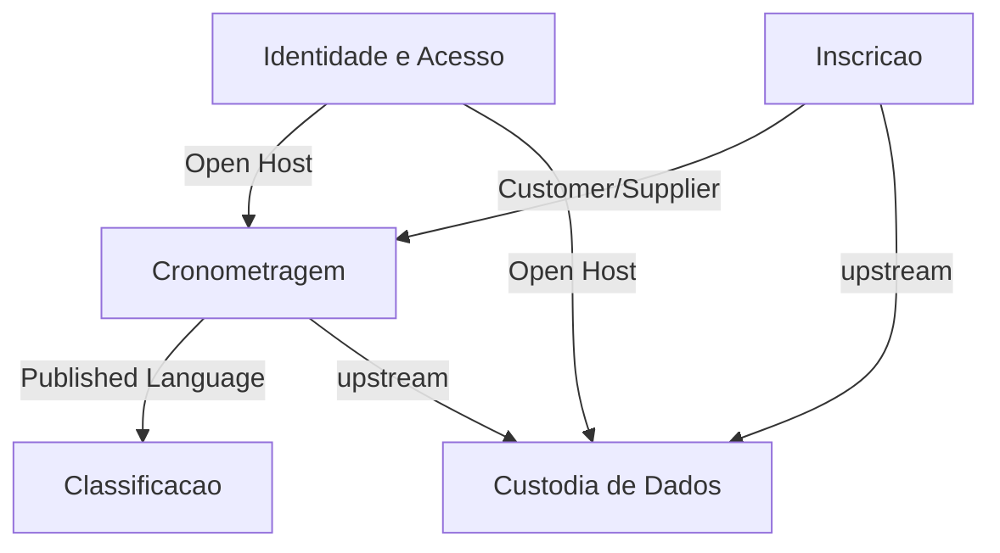

# System Design Document — Sistema de Cadastro e Classificação de Corrida

**Documento de referência:** PRD v2.0
**Escopo:** Evento presencial de um dia, duas pistas, 2000+ participantes

---

## 1. Sumário da arquitetura

O sistema é um monólito modular com fronteiras internas explícitas, exposto por três superfícies distintas: cadastro público, painel autenticado e classificação pública em cache.

A decisão estrutural central é que **as fronteiras entre contextos são também a barreira de privacidade**. O contexto de Classificação não conhece e-mail, telefone ou idade — não por disciplina de código, mas porque o modelo que ele consome não contém esses campos. Isso transforma RNF-08 e RNF-09 de convenção em propriedade estrutural.

A segunda decisão estrutural é que **nenhum acesso a dados parte do dispositivo do usuário final**. Toda leitura e escrita atravessa a camada de aplicação no servidor. Isso sustenta RNF-10, RNF-12 e RNF-13 num único ponto de controle.

---

## 2. Bounded Contexts

### Mapa de contextos



---

### BC-01 — Inscrição

**Responsabilidade.** Estabelecer que uma pessoa existe no evento, com identidade suficiente para ser distinguida de homônimos, e com base legal para o tratamento dos seus dados.

**Por que é um contexto próprio.** A regra de negócio dominante aqui não é atlética, é jurídica. A idade não é atributo descritivo: ela é o discriminador que decide qual conjunto de obrigações se aplica ao registro. Um Participante de 17 anos e um de 18 são objetos com invariantes diferentes. Misturar isso com cronometragem produziria um modelo onde a validade legal de um cadastro depende de código que também calcula posições.

**Invariantes.**
- Nenhum Participante existe sem Consentimento registrado (RF-08)
- Nenhum Participante com idade abaixo de 18 existe sem Responsável completo e consentimento do Responsável (RF-06, RNF-07)
- Idade inferior a 13 não produz Participante (RF-04)
- Toda Inscrição declara ao menos um Pitch (RF-03)

**O que publica.** O evento `InscriçãoConfirmada`, contendo identificador do Participante, os Pitches declarados e o instante da inscrição. Não publica dados pessoais.

**Requisitos que ancora.** RF-01 a RF-10, RNF-07, RNF-12, RNF-13, RNF-15, RNF-17.

---

### BC-02 — Cronometragem

**Responsabilidade.** Registrar o desfecho da participação de uma pessoa em uma pista, e manter a rastreabilidade de quem registrou o quê.

**Por que é um contexto próprio.** É o único contexto com escrita sob pressão de tempo real e com operador humano no caminho crítico. Seus requisitos são de ergonomia e integridade, não de validação de entrada. É também o único que produz dado novo durante o evento.

**Agregado raiz: Tentativa.** Uma Tentativa nasce Pendente no momento da Inscrição e transiciona uma única vez para Válida ou Ausente. A Tentativa, não o Participante, é o objeto que carrega o Pitch — decisão que decorre de RF-03 e RF-24, já que a mesma pessoa pode disputar as duas pistas.

**Máquina de estados.**

```
Pendente ──lançar tempo──▶ Válida ──corrigir──▶ Válida
    │                          
    └──marcar ausência──▶ Ausente
```

Uma Tentativa Ausente não retorna a Pendente. Se a pessoa reaparecer e correr, o operador lança o tempo diretamente, o que transiciona para Válida.

**Invariantes.**
- No máximo uma Tentativa por Participante por Pitch (RF-25)
- Tentativa Válida sempre possui Tempo; Pendente e Ausente nunca possuem (RF-21)
- Toda transição registra Operador e instante (RF-23)

**O que publica.** `TempoRegistrado`, `TempoCorrigido`, `AusênciaMarcada`.

**Requisitos que ancora.** RF-12 a RF-25, RNF-03, RNF-16.

---

### BC-03 — Classificação

**Responsabilidade.** Produzir e servir a ordenação pública das Tentativas Válidas.

**Por que é um contexto próprio, e não uma consulta.** Três razões, em ordem de peso.

Primeiro, **privacidade estrutural**. Este contexto opera sobre Nome Público — um conceito que não existe em Inscrição. A tradução acontece na fronteira, uma única vez, e é lá que a idade decide o formato: maior de idade sai por extenso, menor de 18 sai com a inicial ("Lucas M."). O modelo desse lado não tem e-mail, telefone, idade nem sobrenome — a idade entra na projeção só para decidir o formato e não é copiada adiante. Não existe caminho de código pelo qual o sobrenome de um menor alcance a superfície pública.

Segundo, **perfil de carga oposto**. Inscrição e Cronometragem são escrita esparsa; Classificação é leitura massiva e concentrada. Cerca de 2000 pessoas consultando repetidamente durante poucas horas. Tratar isso como consulta ao modelo transacional coloca o pico de leitura do evento em cima do banco que o supervisor precisa para trabalhar.

Terceiro, **tolerância a defasagem**. RNF-03 admite 30 segundos de atraso. Inscrição e Cronometragem não admitem defasagem alguma. São garantias de consistência incompatíveis no mesmo modelo.

**Modelo de leitura.** Projeção materializada contendo apenas: identificador da Tentativa, Nome Público, Pitch, Tempo e instante do registro. Ordenada por Tempo crescente, desempatada pelo registro mais antigo (RF-31).

**Estratégia de entrega.** A projeção completa é servida como um único documento em cache, com janela de revalidação de 15 segundos. Busca e filtro (RF-29, RF-30) executam no dispositivo do usuário sobre o documento já recebido.

O dimensionamento sustenta essa escolha: 4000 Tentativas em formato compacto produzem aproximadamente 200 KB, cerca de 40 KB comprimidos. Transferir isso uma vez e filtrar localmente custa menos que uma requisição por tecla digitada — que, com 2000 pessoas buscando, seria o único cenário capaz de derrubar o sistema.

**Requisitos que ancora.** RF-26 a RF-33, RNF-01, RNF-03, RNF-08, RNF-09.

---

### BC-04 — Identidade e Acesso

**Responsabilidade.** Autenticar Operadores e fornecer sua identidade aos demais contextos.

**Por que é um contexto próprio.** É genérico e substituível. Não contém regra do domínio de corrida. Isolá-lo permite que Cronometragem dependa apenas do conceito de "Operador autenticado", sem conhecer o mecanismo.

**Invariantes.**
- Não existe criação pública de conta (RNF-14)
- Múltiplas sessões simultâneas de Operadores distintos são permitidas (RF-12)

**Requisitos que ancora.** RF-11, RF-12, RNF-14.

---

### BC-05 — Custódia de Dados

**Responsabilidade.** Exportação completa, retenção e exclusão.

**Por que é um contexto próprio.** É o **único** contexto autorizado a reunir dados pessoais de Inscrição com resultados de Cronometragem no mesmo documento. Essa autorização precisa ser um ponto único, nomeado e auditável — não uma capacidade difusa. É também o contexto com ciclo de vida distinto: sua atividade principal ocorre depois que todos os outros já pararam.

**Requisitos que ancora.** RF-34, RF-35, RNF-10, RNF-11.

---

## 3. Linguagem Ubíqua

### Nota preliminar sobre "Pitch"

O PRD usa "Pista"; a equipe do evento fala "Pitch 1" e "Pitch 2". **A linguagem ubíqua deve seguir o vocabulário falado, não o escrito.** Se no dia do evento o supervisor vai dizer "esse é do pitch 2", o código, a interface e este documento devem dizer Pitch. Adoto **Pitch** como termo oficial e trato "Pista" como sinônimo obsoleto, a ser eliminado da documentação.

Essa é uma decisão a confirmar com o organizador antes da implementação. Divergência entre o termo do código e o termo falado no corredor é origem clássica de erro de operação.

### Glossário

**Participante** — Pessoa que concluiu uma Inscrição válida. Existe independentemente de ter corrido. Não confundir com Competidor, termo que não usamos.

**Responsável** — Adulto que autoriza a participação de Participante menor de 18 anos. Não é usuário do sistema; é sujeito de dados registrado.

**Inscrição** — Ato de registro de um Participante, incluindo a declaração dos Pitches pretendidos e o Consentimento. Ocorre uma única vez por pessoa.

**Consentimento** — Manifestação registrada de concordância com o tratamento dos dados. Para menores de 18, compreende obrigatoriamente a manifestação do Responsável.

**Pitch** — Uma das duas pistas do evento. Valores possíveis: 1 e 2. É atributo da Tentativa, nunca do Participante.

**Tentativa** — Intenção registrada de um Participante disputar um Pitch específico. Nasce Pendente na Inscrição. Um Participante possui de uma a duas Tentativas. Este é o conceito que muitas pessoas chamam informalmente de "corrida"; evitar esse uso, pois "corrida" também nomeia o evento inteiro.

**Pendente** — Estado da Tentativa cujo desfecho ainda não foi registrado. Compõe a Fila.

**Válida** — Estado da Tentativa com Tempo registrado. Única condição para aparecer na Classificação.

**Ausente** — Estado da Tentativa de Participante que não compareceu. Sai da Fila, permanece na Exportação, não aparece na Classificação. Não é exclusão.

**Tempo** — Duração da corrida, aferida por cronômetro externo e digitada pelo Operador. Precisão de centésimo de segundo. Armazenado como inteiro em milissegundos; formatado como `mm:ss.cc` na exibição. O sistema não afere Tempo, apenas o registra.

**Lançamento** — Ato do Operador de registrar um Tempo. Distinto de Tempo: Lançamento é o evento, Tempo é o valor. RF-23 rastreia Lançamentos, não Tempos.

**Fila** — Conjunto ordenado de Tentativas Pendentes de um Pitch, do cadastro mais antigo para o mais recente. É a visão padrão de trabalho do Operador. Não é fila física de pessoas, embora tenda a coincidir com ela.

**Operador** — Usuário autenticado que realiza Lançamentos. Chamado de "supervisor" pelo organizador; os termos são equivalentes e Operador é o oficial no sistema.

**Nome Público** — Identificador do Participante em superfície pública, e o único admissível ali. Para maior de idade, nome e sobrenome completos; para menor de 18, nome e apenas a inicial do sobrenome (RNF-09, revisado em 2026-08-19). Existe somente no contexto de Classificação. **Consequência conhecida:** o formato abreviado sinaliza que a pessoa é menor de idade — aceito em D-21 como exposição menor que a do nome completo.

**Posição** — Índice ordinal de uma Tentativa Válida na Classificação. **Relativa ao filtro aplicado**: filtrar por Pitch renumera a partir de 1 (RF-29). Não é atributo persistido; é calculada na apresentação.

**Desempate** — Regra aplicada a Tempos idênticos: prevalece o Lançamento mais antigo (RF-31).

**Exportação** — Documento tabular com todos os Participantes, dados de Responsáveis e Tentativas. Contém dados pessoais completos. Restrito a Operador autenticado.

**Retenção** — Prazo acordado durante o qual os dados permanecem armazenados após o evento, findo o qual são excluídos (RNF-11).

---

## 4. Camada de transporte por fluxo

### 4.1 Enquadramento da decisão

Antes da tabela, é necessário ser explícito sobre o que está de fato em disputa.

**Todo dado de domínio deste sistema exige entrega confiável, ordenada e íntegra.** Não existe fluxo de negócio aqui que tolere perda de datagrama. Isso elimina UDP puro como transporte de dados de aplicação — a conclusão é uniforme, e apresentá-la como se fosse um julgamento fluxo a fluxo seria teatro.

A decisão real ocorre um nível acima: **HTTP/2 sobre TCP ou HTTP/3 sobre QUIC**. QUIC entrega confiabilidade, ordenação e controle de congestionamento na camada de aplicação, usando datagramas UDP como substrato. Portanto "UDP" aparece legitimamente nas escolhas deste sistema, mas nunca como UDP não confiável — sempre como QUIC.

Além disso, três fluxos de infraestrutura usam UDP puro por razões corretas. Um deles tem consequência direta sobre a integridade do Desempate.

### 4.2 Tabela de fluxos

| ID | Fluxo | Transporte | RNF motivador |
|---|---|---|---|
| FL-01 | Resolução de nome ao abrir o QR | UDP/53, fallback TCP | RNF-04 |
| FL-02 | Carga da página de cadastro | QUIC sobre UDP/443, fallback TCP | RNF-04 |
| FL-03 | Envio do cadastro | TCP (ou QUIC), sempre confiável | RNF-07, RNF-13 |
| FL-04 | Autenticação do Operador | TCP com TLS | RNF-14 |
| FL-05 | Carga da Fila no painel | TCP | RNF-16 |
| FL-06 | Lançamento de Tempo | TCP | RF-23, RF-25 |
| FL-07 | Leitura da Classificação | QUIC sobre UDP/443, fallback TCP | RNF-01, RNF-04 |
| FL-08 | Atualização da Classificação | TCP, polling | RNF-03 |
| FL-09 | Aplicação ao banco de dados | TCP com TLS | RNF-02 |
| FL-10 | Sincronização de relógio dos dispositivos | UDP/123 | RF-31, RF-23 |
| FL-11 | Exportação | TCP | RF-34 |
| FL-12 | Telemetria de monitoramento | UDP, sem confirmação | RNF-05 |

### 4.3 Justificativas

**FL-02 e FL-07 — QUIC sobre UDP, motivado por RNF-04**

RNF-04 exige carga em até 3 segundos em conexão móvel lenta. O cenário real é pior que o enunciado: centenas de celulares na mesma célula de rede, num galpão ou área externa, com perda de pacotes elevada.

É exatamente a condição em que TCP se comporta mal. Sob perda, o TCP sofre bloqueio de cabeça de fila: um segmento perdido trava a entrega de todos os dados subsequentes já recebidos, porque a ordenação é garantida no nível da conexão. Com HTTP/2 multiplexando várias requisições sobre uma única conexão TCP, um pacote perdido de uma imagem atrasa o HTML.

QUIC resolve isso por construção: cada stream tem ordenação independente, e a perda em um não bloqueia os demais. Soma-se o estabelecimento de conexão em menos viagens de ida e volta, já que o handshake criptográfico é fundido ao de transporte.

Há um segundo ganho específico deste cenário. QUIC identifica a conexão por um identificador próprio, não pela tupla de endereço e porta. Um participante que sai do Wi-Fi do evento para a rede móvel no meio do envio mantém a conexão viva. Sobre TCP, essa transição derruba a conexão e o cadastro precisa recomeçar.

**Consequência de projeto:** a hospedagem escolhida precisa anunciar HTTP/3. Isso é verificável antes do evento e deve entrar no checklist.

**FL-03 e FL-06 — confiabilidade absoluta, motivada por RNF-07, RNF-13 e RF-23**

O envio do cadastro carrega, no caso de menores, o registro de Consentimento do Responsável. Sua perda parcial não é degradação de serviço: é ausência de base legal para dados já coletados. RNF-07 não admite entrega probabilística.

O mesmo vale para o Lançamento. RF-25 estabelece unicidade por Participante e Pitch; RF-23 exige rastreabilidade de autoria. Ambos pressupõem que a escrita ou aconteceu integralmente ou não aconteceu.

**Refinamento necessário:** confiabilidade de transporte garante entrega, não unicidade de efeito. Se a confirmação se perder no retorno, o Operador reenvia e a operação executa duas vezes. Transporte não resolve isso — **exige chave de idempotência na camada de aplicação** para FL-03 e FL-06. Este é o ponto onde depender apenas do TCP produz defeito real.

**FL-08 — polling sobre TCP, motivado por RNF-03**

RNF-03 admite 30 segundos de defasagem. Essa folga é generosa e deve ser gasta com prudência.

Conexão persistente por WebSocket entregaria latência muito menor, ao custo de manter milhares de conexões abertas simultaneamente, com reconexão a gerenciar em rede instável. Isso adiciona um modo de falha sob carga para comprar latência que o requisito não pede.

Polling sobre requisições curtas e cacheáveis atende RNF-03 com margem, mantém o custo de servidor previsível e degrada graciosamente: uma requisição perdida simplesmente atrasa uma atualização.

**UDP é inadequado aqui** apesar de "atualização periódica de estado" parecer o caso de uso clássico de UDP em jogos. A diferença é decisiva: em jogo, o estado é contínuo e um quadro perdido é substituído pelo próximo. Aqui, o cliente recebe a Classificação **completa** a cada ciclo, e essa carga excede o tamanho de datagrama único — exigiria fragmentação e remontagem, ou seja, reimplementar TCP mal.

**FL-10 — NTP sobre UDP, motivado por RF-31 e RF-23**

Este é o fluxo que mais recompensa atenção, e o mais fácil de esquecer.

RF-31 define o Desempate pelo Lançamento mais antigo. RF-12 permite Operadores simultâneos. Se dois dispositivos operarem com relógios divergentes, dois Tempos idênticos podem ser ordenados incorretamente, e o registro de autoria de RF-23 perde valor probatório.

*Mitigação de projeto:* o instante autoritativo deve ser o do servidor, não o do dispositivo do Operador. Isso reduz o problema a manter a sincronia do servidor, não a de cada tablet em campo.

*Por que UDP é correto para NTP:* o protocolo estima o desvio do relógio a partir do tempo de ida e volta, assumindo simetria de caminho. Retransmissão e enfileiramento do TCP introduzem atraso assimétrico e invisível, que **corrompe justamente a medida** que o protocolo pretende obter. Aqui a ausência de confiabilidade não é concessão — é requisito. Um pacote NTP perdido deve ser descartado, não retransmitido tarde: a amostra atrasada é pior que amostra nenhuma.

**FL-12 — telemetria sobre UDP, motivada por RNF-05**

RNF-05 exige disponibilidade contínua durante a janela do evento, o que pressupõe monitoramento ativo.

Métricas emitidas sem confirmação são o padrão correto porque a coleta **jamais pode adicionar latência ao caminho da requisição nem falhar junto com ela**. Se o coletor de métricas cair, uma emissão bloqueante sobre TCP propaga a falha para a aplicação — o instrumento derruba o paciente. Perder amostras de métrica é aceitável; perder o serviço por causa do instrumento, não.

Alertas e registros de auditoria não seguem esta regra e usam transporte confiável.

---

## 5. Consistência e modos de falha

**Consistência.** Inscrição e Cronometragem são fortemente consistentes. Classificação é eventualmente consistente, com janela contratada de 15 segundos e limite de 30 por RNF-03.

**Falhas previstas e resposta esperada:**

| Falha | Efeito | Resposta |
|---|---|---|
| Perda de conectividade no local | Cadastro indisponível | Procedimento em papel, digitação posterior (RNF-06) |
| Reenvio duplicado de Lançamento | Escrita repetida | Idempotência na aplicação |
| Divergência de relógio entre Operadores | Desempate incorreto | Instante autoritativo do servidor |
| Pico de leitura da Classificação | Latência acima de RNF-01 | Cache na borda absorve; banco não é atingido |
| Queda do coletor de métricas | Perda de observabilidade | Emissão não bloqueante isola a falha |
| Operador sobrecarregado | Fila física cresce | Segundo Operador autenticado (RF-12) |

---

## 6. Verificações prévias ao evento

- [ ] Confirmar que a hospedagem anuncia HTTP/3, sob pena de FL-02 e FL-07 caírem para TCP e RNF-04 ficar em risco
- [ ] Validar idempotência de FL-03 e FL-06 sob reenvio deliberado
- [ ] Confirmar sincronia de relógio do servidor e que o instante de Lançamento é o do servidor
- [ ] Teste de carga de FL-07 com 500 acessos concorrentes (RNF-01)
- [ ] Confirmar com o organizador o termo oficial: Pitch ou Pista
- [ ] Verificar ausência de campo pessoal em toda resposta pública (RNF-08, RNF-09)

---

## Anexo — Restrições de implementação

1. Verificação de resultado pela leitura do código produzido, não pela renderização no navegador.
2. Validação existente na interface sempre reaplicada de forma independente no servidor.
3. Consultas a dados não partem do navegador do usuário final.
